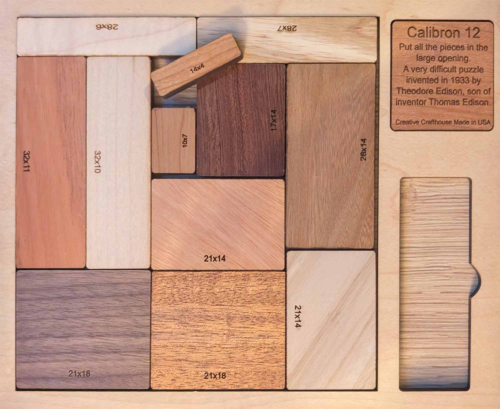

# Calibron-12

Simple implementation to solve the infamous Calibron-12 puzzle.

With the optimizations in place, the solution should be found in just a couple of seconds on consumer-grade hardware.



## About the Calibron-12 Puzzle

The Calibron-12 is a classic packing puzzle created by Theodore Edison (son of Thomas Edison) in the 1930s. It consists of 12 rectangular blocks of different sizes that must be arranged to form a perfect 56×56 square.

### Puzzle Specifications

- **Board Size**: 56×56 square
- **Number of Pieces**: 12 rectangular blocks
- **Piece Dimensions**:
  - 28×6, 28×7, 32×11, 32×10
  - 14×4, 10×7, 17×14, 28×14
  - 21×14, 21×18, 21×18, 21×14

The puzzle is notoriously difficult, with only a few known solutions. The mathematical challenge comes from fitting these 12 pieces with different dimensions into a perfect square without any gaps or overlaps.

## Algorithm Overview

This implementation uses a backtracking algorithm with several optimizations:

1. **Piece Prioritization**: Pieces are sorted by area (largest first) and perimeter to optimize placement. Larger pieces are more constrained and harder to place, so placing them early reduces the search space.

2. **Placement Strategy**: Pieces are always placed at the top-leftmost empty position in the board, maintaining a compact arrangement.

3. **Orientation Testing**: For each piece, both orientations (original and rotated 90°) are tested.

4. **Efficient Backtracking**: When a piece cannot be placed, the algorithm backtracks and tries alternative configurations.

## Running the Solver

```bash
python calibron.py
```

The solver will attempt to find a valid solution and display it when found.

## Time Complexity

The worst-case time complexity is O(2^n * n!), where n is the number of pieces, as:
- Each piece has 2 orientations
- There are n! different ways to order n pieces
- The search space is pruned by heuristics and early termination

## Further Reading

- [Calibron 12 Block Puzzle](https://en.wikipedia.org/wiki/Packing_problems)
- [Packing Problems](https://en.wikipedia.org/wiki/Packing_problems)

## Acknowledgements

Special thanks to my sister who introduced me to this fascinating puzzle during our vacation in the rockies. I might have been obsessing a little bit with it since then ❤️
